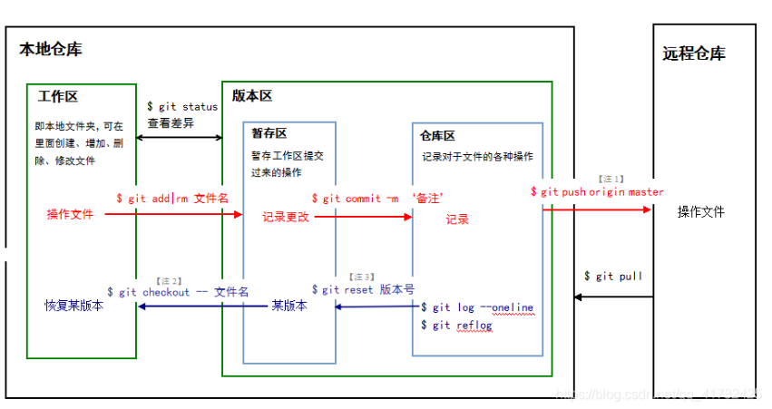
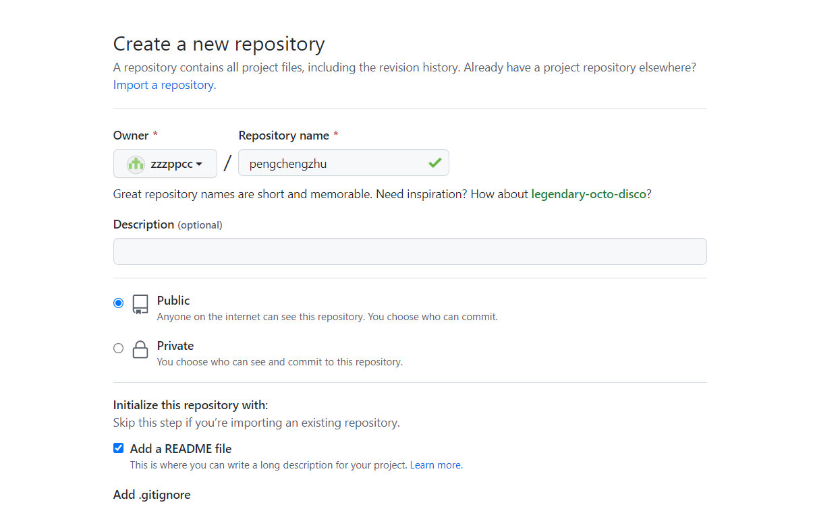

# Git使用

- 下载[git](https://git-scm.com/downloads)并安装和注册github账号

- 原理简介

  - 仓库：**本地仓库**和**远程仓库**(托管在网络端的仓库)

  - 本地仓库：**工作区丶版本区，**其中版本区包含**暂存区丶仓库区**

  - 从本地仓库将文件git到远程仓库流程：**工作区----> 暂存区 ----> 仓库区 ----> 远程仓库**

  

- 用户配置信息

  ```javascript
  git config --global user.name "your name" //github注册时名字
  git config --global user.email "your email" //注册时的邮箱
  
  #查看是否配置成功
  git config user.name
  git config user.email
  ```

- **ssh**密钥生成

  ```javascript
  ssh-keygen -t rsa -C "your email" //注册时的邮箱
  ```

  - 默认安装秘钥在的地 `C:\Users\Administrator\.ssh`   里面选择`id_rsa.pub`里面的内容
  - 默认位置找不到可以通过`cd ~/.ssh`，然后`ls` 查看当前目录下的文件，`vi id_rsa.pub`，打开文件，选中内容右击点击复制

- 密钥使用

  在github中打开“settings”的“SSH Keys”页面，然后，点`New SSH Key`，填上任意title，在key文本框里粘贴 `id_rsa.pub·`文件的内容，点“Add Key”，就应该看到已经添加的Key.

- 项目创建

  

  

- 本地克隆

  ```javascript
  git clone https // git clone https://github.com/zzzppcc/test.git
  ```

- 提交命令

  ```javascript
  git add . //文件添加到暂缓区
  git commit -m "update" //暂缓区提交到仓库区 -m 为本次提交的信息
  git push origin main // 仓库区推送到远程仓库
  ```

- 其他命令

  ```javascript
  git log   //查看提交日志
  git pull  // 命令用于从远程获取代码并合并本地的版本。git pull 其实就是 git fetch 和 git merge 合并
            //git pull origin master
  ```

  