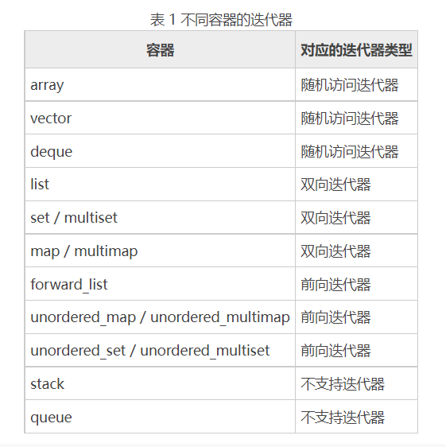
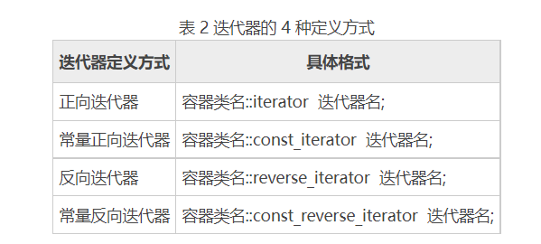
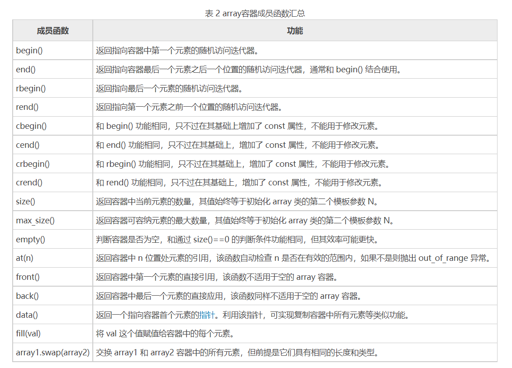
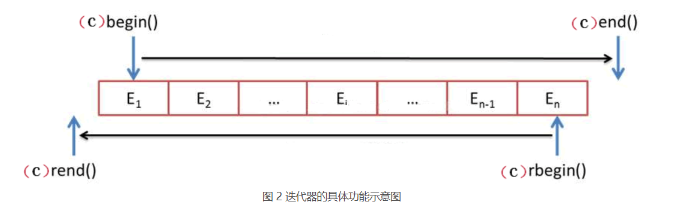
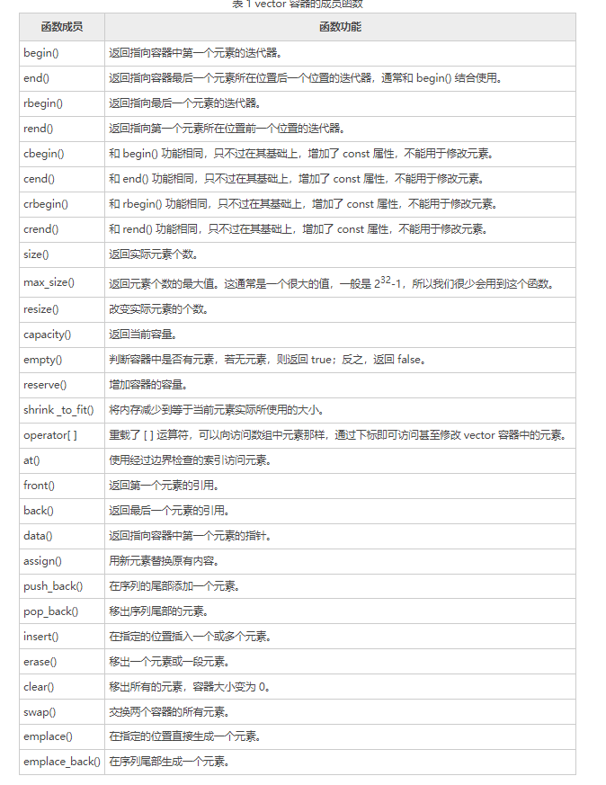
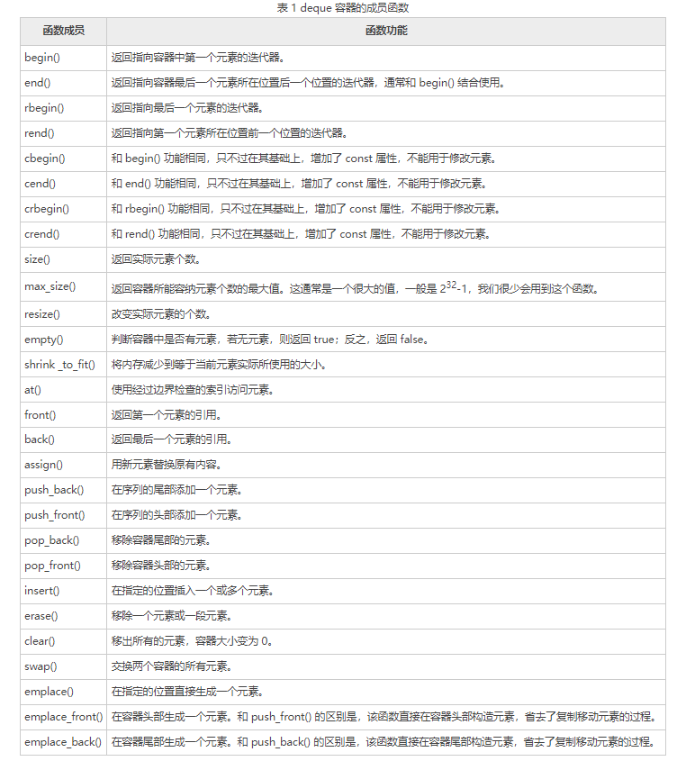
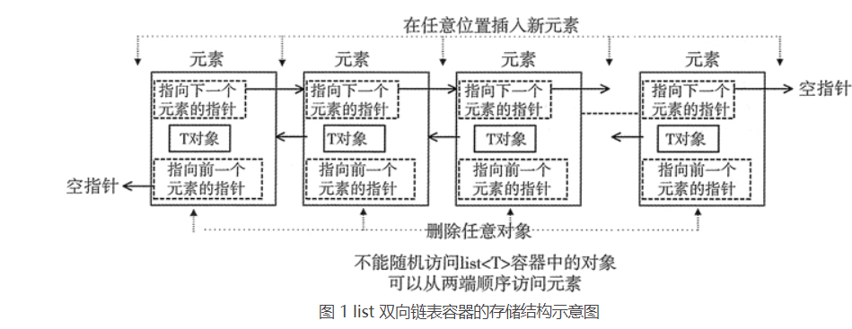
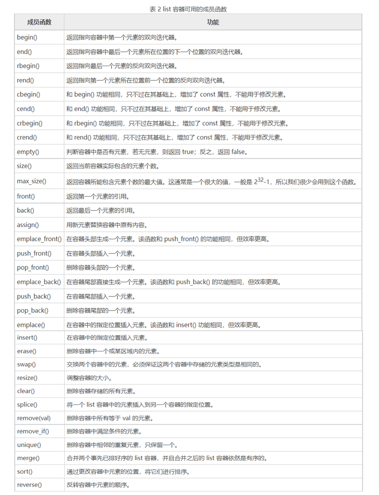
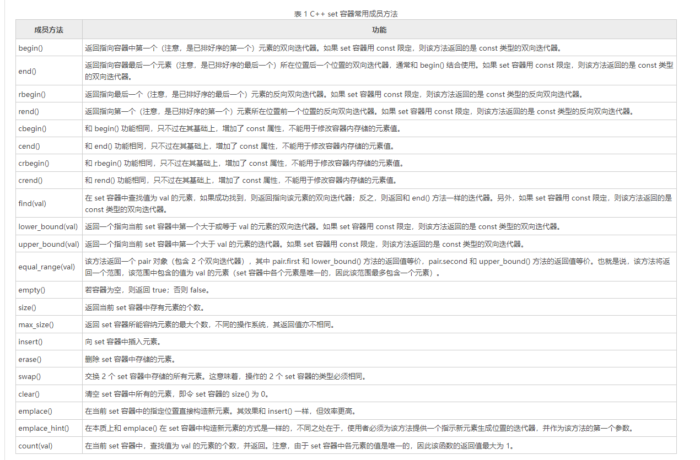
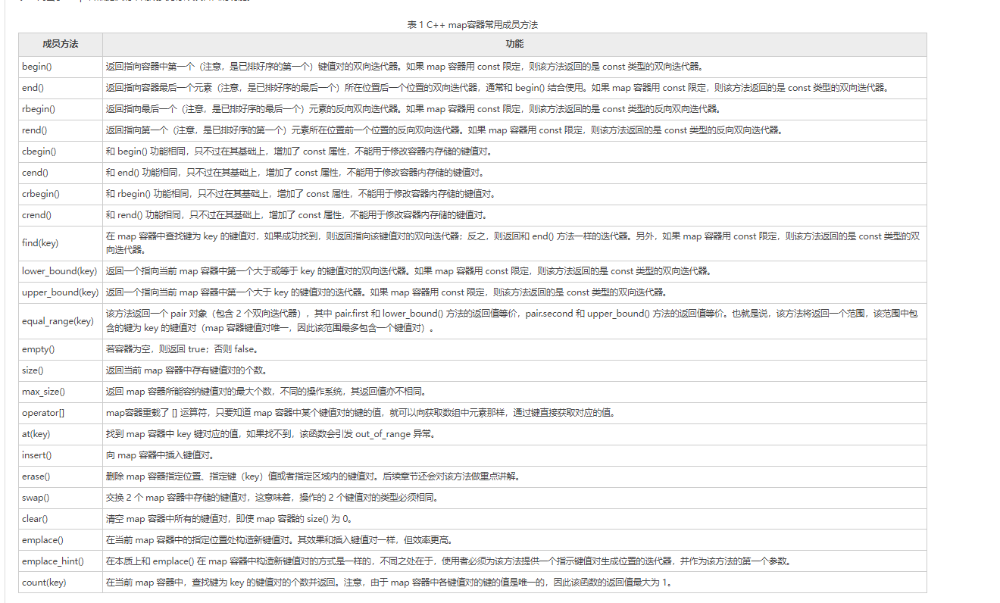

# STL容器

- 简单的理解容器，它就是一些模板类的集合，但和普通模板类不同的是，容器中封装的是组织数据的方法（也就是数据结构）

- 序列式容器：主要包括 vector 向量容器、list 列表容器以及 `deque `双端队列容器。之所以被称为序列容器，是因为元素在容器中的位置同元素的值无关，即容器不是排序的。将元素插入容器时，指定在什么位置，元素就会位于什么位置。

- 关联式容器：

  1、排序容器：包括 `set` 集合容器、`multiset`多重集合容器、`map`映射容器以及 `multimap` 多重映射容器。排序容器中的元素默认是由小到大排序好的，即便是插入元素，元素也会插入到适当位置。所以关联容器在查找时具有非常好的性能。

  2、哈希容器：C++ 11 新加入 4 种关联式容器，分别是 `unordered_set` 哈希集合、`unordered_multiset` 哈希多重集合、`unordered_map` 哈希映射以及` unordered_multimap` 哈希多重映射。和排序容器不同，哈希容器中的元素是未排序的，元素的位置由哈希函数确定。

- 迭代器

  - 无论是序列容器还是关联容器，最常做的操作无疑是遍历容器中存储的元素，而实现此操作，多数情况会选用“迭代器iterator来实现。简单来讲，迭代器和 C++的指针非常类似，它可以是需要的任意类型，通过迭代器可以指向容器中的某个元素，如果需要，还可以对该元素进行读/写操作。

  - 常用的迭代器按功能强弱分为输入迭代器、输出迭代器、前向迭代器、双向迭代器、随机访问迭代器 5 种（输入迭代器和输出迭代器比较特殊，它们不是把数组或容器当做操作对象，而是把输入流/输出流作为操作对象。有关这 2 个迭代器，我们会在后续章节做详细介绍。）
  -   前向迭代器（forward iterator）：假设 p 是一个前向迭代器，则 p 支持 ++p，p++，*p 操作，还可以被复制或赋值，可以用 == 和 != 运算符进行比较。此外，两个正向迭代器可以互相赋值。
  - 双向迭代器（bidirectional iterator）：双向迭代器具有正向迭代器的全部功能，除此之外，假设 p 是一个双向迭代器，则还可以进行 --p 或者 p-- 操作（即一次向后移动一个位置）。
  - 随机访问迭代器（random access iterator）：随机访问迭代器具有双向迭代器的全部功能。除此之外，假设 p 是一个随机访问迭代器，i 是一个整型变量或常量，则 p 还支持以下操作：p+=i：使得 p 往后移动 i 个元素。p-=i：使得 p 往前移动 i 个元素。p+i：返回 p 后面第 i 个元素的迭代器。p-i：返回 p 前面第 i 个元素的迭代器。p[i]：返回 p 后面第 i 个元素的引用。（此外，两个随机访问迭代器 p1、p2 还可以用 <、>、<=、>= 运算符进行比较。另外，表达式 p2-p1 也是有定义的，其返回值表示 p2 所指向元素和 p1 所指向元素的序号之差（也可以说是 p2 和 p1 之间的元素个数减一），**前向迭代器和双向迭代器不可以只可以使用==和！=**）。

  -  对于容器适配器 stack 和 queue 没有迭代器，它们包含有一些成员函数，可以用来对元素进行访问。

    

  - **对于迭代器的定义式有统一的形式，他们会根据自己所属于的容器才会有上述介绍的三个不同规则使用方法**。

  - 通过定义以上几种迭代器，就可以读取它指向的元素，`*迭代器名`就表示迭代器指向的元素。其中，常量迭代器和非常量迭代器的分别在于，通过非常量迭代器还能修改其指向的元素。另外，反向迭代器和正向迭代器的区别在于：

    - 对正向迭代器进行 ++ 操作时，迭代器会指向容器中的后一个元素。
    - 而对反向迭代器进行 ++ 操作时，迭代器会指向容器中的前一个元素。
    - **正向和反向迭代器和前向迭代器、双向迭代器、随机迭代器不要弄混淆，不是一个东西。前者是定义一个迭代器，后者是对应容器的迭代器的使用规则，也就是说定义这个迭代器之后，这个使用规则是什么**

  

  ```c++
  //遍历 vector 容器。 vector 容器为例，vector 支持随机访问迭代器，因此遍历 vector 容器有以下几种做法。下面的程序中，每个循环演示了一种做法：
  #include <iostream>
  #include <vector>
  using namespace std;
  int main()
  {
      vector<int> v{1,2,3,4,5,6,7,8,9,10}; //v被初始化成有10个元素
      cout << "第一种遍历方法：" << endl;
      //size返回元素个数
      for (int i = 0; i < v.size(); ++i)
          cout << v[i] <<" "; //像普通数组一样使用vector容器
      //创建一个正向迭代器，当然，vector也支持其他 3 种定义迭代器的方式
      
         cout << endl << "第二种遍历方法：" << endl;
         vector<int>::iterator i;
      //用 != 比较两个迭代器
      for (i = v.begin(); i != v.end(); ++i)
          cout << *i << " ";
      
         cout << endl << "第三种遍历方法：" << endl;
      for (i = v.begin(); i < v.end(); ++i) //用 < 比较两个迭代器
          cout << *i << " ";
     
         cout << endl << "第四种遍历方法：" << endl;
      i = v.begin();
      while (i < v.end()) { //间隔一个输出
          cout << *i << " ";
          i += 2; // 随机访问迭代器支持 "+= 整数"  的操作
      }
  }
  
  ```

  ```c++
  //list 容器的迭代器是双向迭代器。假设 v 和 i 的定义如下
  //创建一个 v list容器
  list<int> v;
  //创建一个常量正向迭代器，同样，list也支持其他三种定义迭代器的方式。
  list<int>::const_iterator i;
  //合法代码
  for(i = v.begin(); i != v.end(); ++i)
      cout << *i;
  //不合法代码 双向迭代器不支持这个<的操作
  for(i = v.begin(); i < v.end(); ++i)
      cout << *i;
  //不合法代码 双向迭代器不支持随机存取
  for(int i=0; i<v.size(); ++i)
      cout << v[i]
  
  以上的例子说明
      1、迭代器的使用
      2、正向和反向迭代器和前向迭代器、双向迭代器、随机迭代器不要弄混淆，不是一个东西。前者是定义一个迭代器，后者是对应容器的迭代器的使用规则
  ```

## 序列式容器

### array

1. array 容器是 C++ 11 标准中新增的序列容器，简单地理解，它就是在 C++ 普通数组的基础上，**添加了一些成员函数和全局函数**。在使用上，它比普通数组更安全（原因后续会讲），且效率并没有因此变差。

2. 和其它容器不同**，array 容器的大小是固定的，无法动态的扩展或收缩**，这也就意味着，在使用该容器的过程无法借由增加或移除元素而改变其大小，它只允许访问或者替换存储的元素。

3. array 容器以类模板的形式定义在 `<array> `头文件，并位于命名空间 std 中，如下所示：

   ```c++
   namespace std{
       template <typename T, size_t N>
       class array;
   }
   ```

4. array 容器有多种初始化方式(如果程序中已经默认指定了 std 命令空间，这里可以省略 std::)

   ```c++
   std::array<double, 10> values;//由此，就创建好了一个名为 values 的 array 容器，其包含 10 个浮点型元素。但是，由于未显式指定这 10 个元素的值，因此使用这种方式创建的容器中，各个元素的值是不确定的（array 容器不会做默认初始化操作）。
   std::array<double, 10> values {};//通过如下创建 array 容器的方式，可以将所有的元素初始化为 0 或者和默认元素类型等效的值：
   td::array<double, 10> values {0.5,1.0,1.5,,2.0};//在创建 array 容器的实例时，也可以像创建常规数组那样对元素进行初始化,可以看到，这里只初始化了前 4 个元素，剩余的元素都会被初始化为 0.0
   
   ```

   

- array 容器模板类中的 `begin()/end() 和 cbegin()/cend()` 成员函数返回的都是正向迭代器，它们分别指向「首元素」和「尾元素+1」 的位置。在实际使用时，我们可以利用它们实现初始化容器或者遍历容器中元素的操作。

  ```c++
  #include <iostream>
  #include <array>
  using namespace std;
  int main()
  {
      array<int, 5>values;
      int h = 1;
      auto first = values.begin();
      auto last = values.end();
      //初始化 values 容器为{1,2,3,4,5}
      while (first != last)
      {
          *first = h;
          ++first;
          h++;
      }
    
      first = values.begin();
      while (first != last)
      {
          cout << *first << " ";
          ++first;
      }
      return 0; 
  }

- array 模板类中还提供了` rbegin()/rend() 和 crbegin()/crend() `成员函数，它们每对都可以分别得到指向最一个元素和第一个元素前一个位置的随机访问迭代器，又称它们为反向迭代器。(**需要注意的是，在使用反向迭代器进行 ++ 或 -- 运算时，++ 指的是迭代器向左移动一位，-- 指的是迭代器向右移动一位，即这两个运算符的功能也“互换”了**)

  

  ```c++
  #include <iostream>
  #include <array>
  using namespace std;
  int main()
  {
      array<int, 5>values;
      int h = 1;
      auto first = values.rbegin();
      auto last = values.rend(); 
      //初始化 values 容器为 {5,4,3,2,1}
      while (first != last)
      {
          *first = h;
          ++first;
          h++;
      }
      //重新遍历容器，并输入各个元素
      first = values.rbegin();
      while (first != last)
      {
          cout << *first << " ";
          ++first;
      }
      return 0;
  }
  ```

### vector

1. vector容器的功能和数组非常相似，使用时可以把它看成一个数组
2. 数组是静态的，长度不可改变，而vector可以动态扩展，增加长度
3. 数组内数据通常存储在栈上，而vector中数据存储在堆上
4. **动态扩展并不是在原空间之后续接新空间，而是找到比原来更大的内存空间，将原数据拷贝到新空间，释放原空间**

.assets/image-20221010132219310.png)

vector相关函数：



- 创建一个vector ：`vector<ElemType> A , vector<int> arr;`

  ```c++
  vector<int> V;//这是一个空的 vector 容器，因为容器中没有元素，所以没有为其分配空间。当添加第一个元素（比如使用 push_back() 函数）时，vector 会自动分配内存。
  values.reserve(20);
  /*
  1、在创建好空容器的基础上，这样通过调用 reserve() 成员函数来增加容器的容量。这样就设置了容器的内存分配，即至少可以容纳 20 个元素。注意，如果 vector 的容量在执行此语句之前，已经大于或等于 20 个元素，那么这条语句什么也不做；
  2、另外，调用 reserve() 不会影响已存储的元素，也不会生成任何元素，即 values 容器内此时仍然没有任何元素。还需注意的是，如果调用 reserve() 来增加容器容量，之前创建好的任何迭代器（例如开始迭代器和结束迭代器）都可能会失效，这是因为，为了增加容器的容量，vector<T> 容器的元素可能已经被复制或移到了新的内存地址。所以后续再使用这些迭代器时，最好重新生成一下。（这是由于动态扩展并不是在原空间之后续接新空间，而是找到比原来更大的内存空间，将原数据拷贝到新空间，释放原空间）
  */
  vector<int> V {1,2,3,4}//除了创建空 vector 容器外，还可以在创建的同时指定初始值以及元素个数
  vector<int> V(20); //容器开始时就有 20 个元素，它们的默认初始值都为 0。
  vector<double> values(20, 2.0);//初始就有20个元素，指定为2.0
  ```

- 往vector中添加数据和删除数据：

  1、`arr.push_back()`可以再vector的末尾中添加数据

  2、`arr.emplace_back()`可以再vector的末尾中添加数据。二者的区别，就在于底层实现的机制不同。push_back() 向容器尾部添加元素时，首先会创建这个元素，然后再将这个元素拷贝或者移动到容器中（如果是拷贝的话，事后会自行销毁先前创建的这个元素）；而 emplace_back() 在实现时，则是直接在容器尾部创建这个元素，省去了拷贝或移动元素的过程。

  2、`iterator arr.insert(const_iterator pos, elem) ` 在迭代器指向的位置pos**之前**处插入一个元素elem,返回表示新插入元素位置的迭代器。

  3、`iterator arr.insert(const_iterator pos,int count,int elem)` pos**之前**插入count个元素elem,返回表示新插入元素位置的迭代器。

  4、`iterator arr.insert(const_iterator pos,first,last)`在迭代器 pos 指定的位置**之前**，插入其他容器（不仅限于vector）中位于 [first,last) 区域的所有元素，并返回表示第一个新插入元素位置的迭代器。

  5、`iterator arr.insert(const_iterator pos ,list)`在迭代器 pos 指定的位置**之前**，插入初始化列表（用大括号{}括起来的多个元素，中间有逗号隔开）中所有的元素，并返回表示第一个新插入元素位置的迭代器

  ```c++
  #include <iostream> 
  #include <vector> 
  #include <array> 
  using namespace std;
  int main()
  {
      std::vector<int> demo{1,2};
      //第一种格式用法
      demo.insert(demo.begin() + 1, 3);//{1,3,2}
      //第二种格式用法
      demo.insert(demo.end(), 2, 5);//{1,3,2,5,5}
      //第三种格式用法
      std::array<int,3>test{ 7,8,9 };
      demo.insert(demo.end(), test.begin(), test.end());//{1,3,2,5,5,7,8,9}
      //第四种格式用法
      demo.insert(demo.end(), { 10,11 });//{1,3,2,5,5,7,8,9,10,11}
      for (int i = 0; i < demo.size(); i++) {
          cout << demo[i] << " ";
      }
      return 0;
  }
  ```

  6、`iterator arr.emplace(iterator pos ,int num)`迭代器pos位置之前插入num，返回插入位置的迭代器。**效率高于insert**

  7、`arr.pop_back();` 删除最后一个元素

  8、`arr.erase(const_iterator pos);` 删除迭代器指向的元素

  9、`arr.erase(const_iterator begin,const_iterator end);` 删除迭代器从begin到end之间的元素

  10、`arr.clear();` //删除容器中所有元素
  
  ```c++
  #include<bits/stdc++.h>
  using namespace std;
  int main(){
      vector<int> arr;
      for(int i=0;i<10;i++){
           arr.push_back(i);
      }
      arr.insert(arr.begin(),1);
      arr.insert(arr.end(),10);
      arr.insert(arr.begin(),2,-1);
      vector<int>::iterator it = arr.begin();
      for(;it!=arr.end();it++){
          cout<<*it<<endl;
      }
      system("pause");
      return 0;
  }
  ```

- 赋值操作：1、`vector<int> V1,V2 V1=V2 `通过重载运算符赋值.。

​                          2、`arr.assign(v.begin(),v.end());` 将[v.begin(),v.end())区间中的元素赋值给arr这个vector。

​                          3、`arr.assign(n,elem)`; 将n个elem赋值给arr。

```c++
#include<bits/stdc++.h>
using namespace std;
void pprint(vector<int> arr){
    vector<int>::iterator it=arr.begin();
    for(;it!=arr.end();it++){
         cout<<*it<<' ';
    }
    cout<<endl;
}
void ppprint(vector<int> arr){
     for(int i=0;i<arr.size();i++){
         cout<<arr[i]<<' ';
     }
     cout<<endl;
}
int main(){
    vector<int> arr;
    for(int i=0;i<10;i++){
         arr.push_back(i);
    }
    vector<int> V1,V2,V3;
    V1=arr;
    V2.assign(V1.begin(),V1.end());
    V3.assign(10,-1);
    ppprint(V1);
    ppprint(V2);
    ppprint(V3);

    system("pause");
    return 0;
}
```

- vector的容量与大小：

  1、`arr.empty();` 判断容器是否为空，为空返回1，否则返回0

  2、`arr.capacity();` 返回容器的容量

  3、`arr.size();` 返回容器的大小,即容器中元素的个数

  4、`arr.resize(int n);` 重新指定容器的长度为n，若容器变长，以0填充新位置,如果容器变短，则末尾超过超过元素被删除
  5、`arr.resize(int n,int elem);`重新指定容器的长度为n，若容器变长，以elem填充新位置,如果容器变短，超过元素被删除。            
  
  ```c++
  #include<bits/stdc++.h>
  using namespace std;
  void pprint(vector<int> arr){
      vector<int>::iterator it=arr.begin();
      for(;it!=arr.end();it++){
           cout<<*it<<' ';
      }
      cout<<endl;
  }
  void ppprint(vector<int> arr){
       for(int i=0;i<arr.size();i++){
           cout<<arr[i]<<' ';
       }
       cout<<endl;
  }
  int main(){
      vector<int> arr;
      for(int i=0;i<10;i++){
           arr.push_back(i);
      }
      cout<<arr.empty()<<endl;
      cout<<arr.capacity()<<endl;
      cout<<arr.size()<<endl;
      arr.resize(20);
      cout<<arr.capacity()<<endl;
      cout<<arr.size()<<endl;
      ppprint(arr);
      arr.resize(25,-1);
      ppprint(arr);
      arr.resize(5);
      ppprint(arr);
  
      system("pause");
      return 0;
  }
  ```

- vector数据的访问

  1、`arr.at(int idx);` 返回索引 idx 处元素引用，可以通过`arr.at(0)=-999`来修改数据

  2、`arr[i];` 返回`i`索引所指的数据，通过下标访问

  3、`arr.front();` 返回容器中第一个元素

  4、`arr.back();` 返回容器中最后一个元素

  5、`iterator arr.begin();`返回容器第一个位置的指针（迭代器）

  6、`iterator arr.end();`返回容器最后一个位置的指针（迭代器）

  7、`reverse_iterator arr.rbegin():` 反向迭代器，指向最后一个元素 

  8、`reverse_iterator arr.rend():` 反向迭代器，指向第一个元素之前的位置

  9、`arr.data():`返回头元素的指针,可以用于修改数据

- vector两个容器相互交换：`arr.swap(V1)`

### deque

- 前面介绍了 vector 容器，值得一提的是，deque 容器和 vecotr 容器有很多相似之处，比如：

  - deque 容器也擅长在**序列尾部添加或删除元素**（时间复杂度为`O(1)`），而不擅长在序列中间添加或删除元素。
  - deque 容器也可以根据需要**修改自身的容量和大小**。

- 和 vector 不同的是，deque 还擅长在**序列头部添加或删除元素**，所耗费的时间复杂度也为常数阶`O(1)`。并且更重要的一点是，**deque 容器中存储元素并不能保证所有元素都存储到连续的内存空间中**。

- 当需要向序列两端频繁的添加或删除元素时，应首选 deque 容器。

- 创建方法

  ```c++
  std::deque<int> d;
  std::deque<int> d(10);
  std::deque<int> d(10, 5)
  ```

- 和 vector 相比，额外增加了实现在容器头部添加和删除元素的成员函数，同时删除了 capacity()、reserve() 和 data() 成员函数。

- `push_front() 和 pop_front() 对应 push_back() 和 pop_back()`

- 方法



### list

- list 容器，又称双向链表容器，即该容器的底层是以双向链表的形式实现的。这意味着，list 容器中的元素可以分散存储在内存空间里，而不是必须存储在一整块连续的内存空间中。

- 可以看到，list 容器中各个元素的前后顺序是靠指针来维系的，每个元素都配备了 2 个指针，分别指向它的前一个元素和后一个元素。其中第一个元素的前向指针总为 null，因为它前面没有元素；同样，尾部元素的后向指针也总为 null。

- list 容器具有一些其它容器（array、vector 和 deque）所不具备的优势，即它可以在序列已知的任何位置快速插入或删除元素（时间复杂度为`O(1)`）。并且在 list 容器中移动元素，也比其它容器的效率高。

-  list 容器的缺点是，它不能像 array 和 vector 那样，通过位置直接访问元素。举个例子，如果要访问 list 容器中的第 6 个元素，它不支持`容器对象名[6]`这种语法格式，正确的做法是从容器中第一个元素或最后一个元素开始遍历容器，直到找到该位置。

  




- 创建方法

  ```c
  std::list<int> values;
  std::list<int> values(10);
  std::list<int> values(10, 5);

- 方法

  

- list 容器不支持随机访问，未提供下标操作符 [] 和 at() 成员函数，也没有提供 data() 成员函数。

### forward_list 

- forward_list 容器具有和 list 容器相同的特性，即擅长在序列的任何位置进行插入元素或删除元素的操作，但对于访问存储的元素，没有其它容器（如 array、vector）的效率高。

- 由于单链表没有双向链表那样灵活，因此相比 list 容器，forward_list 容器的功能受到了很多限制。比如，由于单链表只能从前向后遍历，而不支持反向遍历，因此 forward_list 容器只提供前向迭代器，而不是双向迭代器。这意味着，forward_list 容器不具有 rbegin()、rend() 之类的成员函数。

- ```c++
  std::forward_list<int> values;
  ```

## 关联式容器

### pair

关联式容器存储的是“键值对”形式的数据，比如：

<"C语言教程", "1">
<"python教程", "2">
<"java教程", "3">

如上所示，每行都表示一个键值对，其中第一个元素作为键（key），第二个元素作为值（value）。

> 注意，基于各个关联式容器存储数据的特点，只有各个键值对中的键和值全部对应相等时，才能使用 set 和 multiset 关联式容器存储，否则就要选用 map 或者 multimap 关联式容器。

考虑到“键值对”并不是普通类型数据，C++ STL 标准库提供了 pair 类模板，其专门用来将 2 个普通元素 first 和 second（可以是 C++ 基本数据类型、结构体、类自定的类型）创建成一个新元素`<first, second>`。通过其构成的元素格式不难看出，使用 pair 类模板来创建“键值对”形式的元素，再合适不过。

```c++
#include <iostream>
#include <utility>      // pair
#include <string>       // string
using namespace std;
int main() {
    // 调用构造函数 1，也就是默认构造函数 常用
    pair <string, double> pair1;
    pair1.first = "Java教程";
    pair1.second = "http://c.biancheng.net/java/";
    // 调用第 2 种构造函数
    pair <string, string> pair2("STL教程","http://c.biancheng.net/stl/");  
    // 调用拷贝构造函数
    pair <string, string> pair3(pair2);
    //调用移动构造函数
    pair <string, string> pair4(make_pair("C++教程", "http://c.biancheng.net/cplus/"));
    // 调用第 5 种构造函数
    pair <string, string> pair5(string("Python教程"), string("http://c.biancheng.net/python/"));  
    cout << "pair1: " << pair1.first << " " << pair1.second << endl;
    cout << "pair2: "<< pair2.first << " " << pair2.second << endl;
    cout << "pair3: " << pair3.first << " " << pair3.second << endl;
    cout << "pair4: " << pair4.first << " " << pair4.second << endl;
    cout << "pair5: " << pair5.first << " " << pair5.second << endl;
    return 0;
}
```

### set

C++ STL标准库中还提供有 set 和 multiset 这 2 个容器，它们也属于关联式容器。不过，本节先讲解 set 容器，后续章节再讲解 multiset 容器。和 map、multimap 容器不同，使用 set 容器存储的各个键值对，要求键 key 和值 value 必须相等。

举个例子，如下有 2 组键值对数据：

{<'a', 1>, <'b', 2>, <'c', 3>}
{<'a', 'a'>, <'b', 'b'>, <'c', 'c'>}

显然，第一组数据中各键值对的键和值不相等，而第二组中各键值对的键和值对应相等。对于 set 容器来说，只能存储第 2 组键值对，而无法存储第一组键值对。

基于 set 容器的这种特性，当使用 set 容器存储键值对时，只需要为其提供各键值对中的 value 值（也就是 key 的值）即可。仍以存储上面第 2 组键值对为例，只需要为 set 容器提供 {'a','b','c'} ，该容器即可成功将它们存储起来。

通过前面的学习我们知道，map、multimap 容器都会自行根据键的大小对存储的键值对进行排序，set 容器也会如此，只不过 set 容器中各键值对的键 key 和值 value 是相等的，根据 key 排序，也就等价为根据 value 排序。

另外，使用 set 容器存储的各个元素的值必须各不相同。更重要的是，从语法上讲 set 容器并没有强制对存储元素的类型做 const 修饰，即 set 容器中存储的元素的值是可以修改的。但是，C++ 标准为了防止用户修改容器中元素的值，对所有可能会实现此操作的行为做了限制，使得在正常情况下，用户是无法做到修改 set 容器中元素的值的。

> 对于初学者来说，切勿尝试直接修改 set 容器中已存储元素的值，这很有可能破坏 set 容器中元素的有序性，最正确的修改 set 容器中元素值的做法是：**先删除该元素，然后再添加一个修改后的元素。**



```c++
#include<bits/stdc++.h>
using namespace std;

int main(){
    set<int> A;
    pair<set<int>::iterator,bool>res;
    res = A.insert(1);
    cout<<*(res.first)<<endl;
    cout<<res.second<<endl;
    cout<<*res.first<<endl;
    cout<<A.size()<<endl;
    cout<<A.empty()<<endl;
    auto flag = A.insert(1);
    cout<<flag.second<<endl;
    A.erase(1);
    cout<<A.empty()<<endl;
    system("pause");
    return 0;
}
```

### map

作为关联式容器的一种，map 容器存储的都是 pair 对象，也就是用 pair 类模板创建的键值对。其中，各个键值对的键和值可以是任意数据类型，包括 C++基本数据类型（int、double 等）、使用结构体或类自定义的类型。

> 通常情况下，map 容器中存储的各个键值对都选用 string 字符串作为键的类型。

与此同时，在使用 map 容器存储多个键值对时，该容器会自动根据各键值对的键的大小，按照既定的规则进行排序。默认情况下，map 容器选用`std::less<T>`排序规则（其中 T 表示键的数据类型），其会根据键的大小对所有键值对做升序排序。当然，根据实际情况的需要，我们可以手动指定 map 容器的排序规则，既可以选用标准库中提供的其它排序规则（比如`std::greater<T>`），也可以自定义排序规则。

另外需要注意的是，使用 map 容器存储的各个键值对，键的值既不能重复也不能被修改。换句话说，map 容器中存储的各个键值对不仅键的值独一无二，键的类型也会用 const 修饰，这意味着只要键值对被存储到 map 容器中，其键的值将不能再做任何修改。

> 前面提到，map 容器存储的都是 pair 类型的键值对元素，更确切的说，该容器存储的都是 pair<const K, T> 类型（其中 K 和 T 分别表示键和值的数据类型）的键值对元素。



```c++
#include<bits/stdc++.h>
using namespace std;

int main(){
    map<int ,int> M;
    int a=1,b=2;
    pair<int ,int> p(a,b);
    make_pair(1,2);
    auto res = M.insert(p);
    cout<<res.first<<endl;
    cout<<(*res.first).first<<endl;
    auto rer = M.insert(make_pair(1,3));// insert返回的是一个pair对,first是map中存在的键值对，second是返回是否插入                                                                                                        bool数值
    cout<<rer.second<<endl;
    for(auto it=M.begin();it!=M.end();it++){
          cout<<(*it).first<<' ';
          cout<<(*it).second<<endl;
    }
    auto A= M.find(2);
    if(A==M.end()){
         cout<<0<<endl;
    }
    M.earse(1);
    system("pause");
    return 0;
}
```

## 容器适配器

### stack

### queue

## 补充

- empty对任意的容器都是常数时间 ，对于list实现，size需要线性时间

