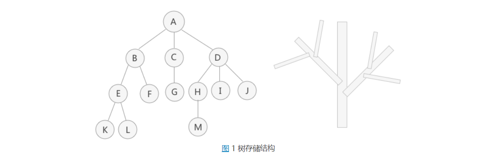
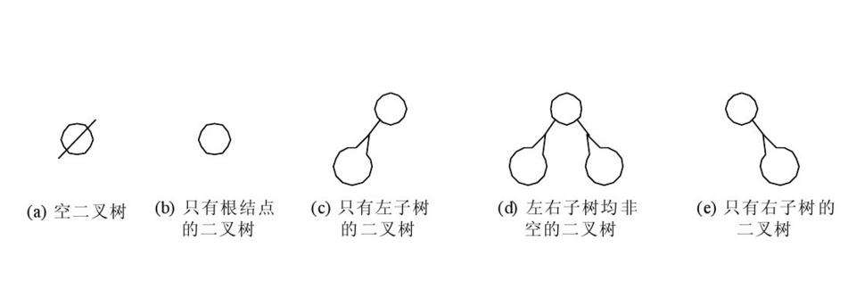

# 树

## 基本概念

定义：

- 树是n个结点的有限集。在任意一棵非空树中：1.有且仅有一个特定的称为根的结点 2.当n＞1时，其余结点可分为m个互不相交的有限集T1,T2,...,Tm，其中每一个集合本身是一棵树，并且称为根的子树”

节点关系：

- 父结点（双亲结点）、孩子结点和兄弟结点：以图 1 中的结点 A、B、C、D 为例，A 是 B、C、D 结点的父结点（也称为“双亲结点”），而 B、C、D 都是 A 结点的孩子结点（也称“子结点”）。对于 B、C、D 来说，它们都有相同的父结点，所以它们互为兄弟结点；
- 树根结点（简称 "根结点" ）：特指树中没有双亲（父亲）的结点，一棵树有且仅有一个根结点。例如图 1 中，结点 A 就是整棵树的根结点；

- 叶子结点（简称 "叶结点" ）：特指树中没有孩子的结点，一棵树可以有多个叶子结点。例如图 1 中，结点 K、L、F、G、M、I、J 都是叶子结点。
- 祖先节点：到某个节点路径上的所有节点成为祖先节点。例如图1中，对于节点k ，其祖先节点为A、B、E

节点的度

- 一个结点拥有子树的个数，就称为该结点的度。例如图 1 中，根结点 A 有 3 个子树，它们的根节点分别是 B、C、D，因此结点 A 的度为 3。

层次：

- 从一棵树的树根开始，树根所在层为第一层，根的孩子结点所在的层为第二层，依次类推。对于图 1这棵树来说，A 结点在第一层，B、C、D 为第二层，E、F、G、H、I、J 在第三层，K、L、M 在第四层。树中结点层次的最大值，称为这棵树的深度或者高度。例如图 1 这棵树的深度为 4。

有序树和无序树

- 如果一棵树中，各个结点左子树和右子树的位置不能交换，那么这棵树就称为有序树。反之，如果树中结点的左、右子树可以互换，那么这棵树就是一棵无序树。
- 在有序树中，结点最左边的子树称为 "第一个孩子"，最右边的称为 "最后一个孩子"。拿图 1 这棵树来说，如果它是一棵有序树，那么以结点 B 为根结点的子树为整棵树的第一个孩子，以结点 D 为根结点的子树为整棵树的最后一个孩子。

森林

- 由 m（m >= 0）个互不相交的树组成的集合就称为森林。比如图 1 中除去 A 结点，那么分别以 B、C、D 为根结点的三棵子树就可以称为森林。

- 前面讲到，树可以理解为是由根结点和若干子树构成的，而这若干子树本身就是一个森林，因此树还可以理解为是由根结点和森林组成的。

 空树

- 空树指的是没有任何结点的树，连根结点都没有。

Note:树可以可以抽象成其他的表示方法

- 图 2 左侧是以嵌套集合的形式表示的（集合之间绝不能相交，即任意两个圆圈不能有交集）。
- 图 2 右侧使用的是凹入表示法，最长条为根结点，相同长度的表示在同一层次。例如 B、C、D 长度相同，都为 A 的子结点，E 和 F 长度相同，为 B 的子结点，K 和 L 长度相同，为 E 的子结点，依此类推。
- 还可以用广义表表示一棵树。例如图 1 用广义表表示为：(A, ( B ( E ( K, L ), F ), C ( G ), D ( H ( M ), I , J ) ) )

# 二叉树

定义：

- 二叉树是n（n >= 0）个结点的有限集合，该集合或空集（称为空二叉树） 或由由一个根结点和两颗不相交的、分别称为根节点的左子树和右子树的二叉树组成。

二叉树五种基本形式：

二叉树性质：

- 在二叉树的第i层上至多有个结点

- 深度为k的二叉树至多有个结点

- 对于任何一棵二叉树 ，如果终端结点数为n0，度为2的结点数为，则

- 具有n个结点的完全二叉树的深度

- 如果对于一棵有n个结点的完全二叉树的结点按照层序编号，如果i = 1，结点无双亲；如果i > 1,则双亲是[i/2]；如果2i  > n,则结点i无左孩子；否则其左孩子为2i；如果2i + 1 > n，则结点i无右孩子；否则右孩子为2i + 1;

  
