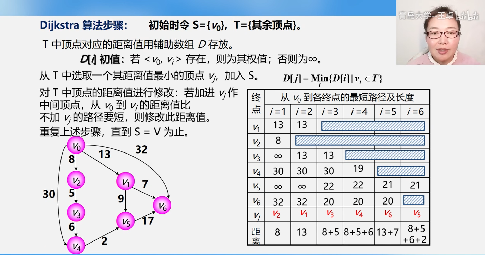

# 图

## 基本概念

图的定义：由顶点集V和边集合E组成，记作G=(V,E)，其中V(G)表示图G中顶点的有限非空集合；E(G)表示图G中顶点之间关系的边集合。

1、有向图

2、无向图

3、简单图和多重图

4、完全图

5、子图

6、连通、连通分量(极大连通子图：极大要求子图尽可能包含所有的边)、强连通分量（极大强连通子图）

7、生成树（极小连通子图：图保持连通但是尽可能包含更少的边）、生成森林

8、顶点的度、出度和入度

9、边的权和网（边上带权值的图称为带权图或者网）

10、稠密图和稀疏图(  |E|<|V|log|V|  边数和顶点数的关系)

11、路径、路径长度、回路

12、简单路径、简单回路（不出现重复顶点）

13、距离

14、有向树

## 图的存储

### 存储形式

1、邻接矩阵

```C++
#define maxsize 100
G[maxsize][maxszie]
```

- 在简单应用中，可直接用二维数组作为图的邻接矩阵(顶点信息等均可省略)。

- 当邻接矩阵的元素仅表示相应边是否存在时，可采用值为0和1的枚举类型。

- 无向图的邻接矩阵是对称矩阵，对规模特大的邻接矩阵可采用压缩存储。

  图的邻接矩阵存储表示法具有以下特点:

  1. 无向图的邻接矩阵一定是一 个对称矩阵 (并且唯一)。 因此，在实际存储邻接矩阵时,只需存储上(或下)三角矩阵的元素。
  2. 对于无向图，邻接矩阵的第i行(或第i列)非零元素(或非∞元素)的个数正好是顶点i的度TD。
  3. 对于有向图，邻接矩阵的第i行非零元素(或非∞元素)的个数正好是顶点i的出度OD(v)，第i列非零元素(或非∞元素)的个数正好是顶点i的入度ID(v)。
  4. 用邻接矩阵存储图，很容易确定图中任意两个顶点之间是否有边相连。但是，要确定图中有多少条边，则必须按行、按列对每个元素进行检测，所花费的时间代价很大。
  5. 稠密图适合使用邻接矩阵的存储表示。
  6. **设图G的邻接矩阵为A,A^n中位置（i，j）的元素表示由顶点i到顶点j的长度为n的路径的数。**

2、邻接表

```C++
#include <bits/stdc++.h>
/*无向图
test sample
0 1
1 2
1 3
2 4 
3 4
2 5
*/
using namespace std;
//通过vector构造邻接表
typedef struct Node{
    int num,weight;
}Node;
vector<Node>q[1001];

typedef struct Arc{
   int num;
   int weight;
   struct Arc *next ;
}Arc;
typedef struct Vex{
    int v;
    Arc *first;
}Vex;
Vex *V[6];

int main()
{
      /**********Vector版本邻接表代码************/
      for(int i=0;i<6;i++){
        int x,y;
        cin>>x>>y;
        Node Node_x;
        Node_x.num=x;
        Node_x.weight=1;
        Node Node_y;
        Node_y.num=y;
        Node_y.weight=1;
        q[x].push_back(Node_y);
        q[y].push_back(Node_x);
     }
     for(int i=0;i<6;i++){
        cout<<"Current Node is:"<<i<<"-->";
        for(int j=0;j<q[i].size();j++){
             cout<<q[i][j].num<<"-->";

        }
        cout<<"NULL"<<endl;
     }
    /**********自定义结构体版本邻接表代码************/
    for(int i=0;i<6;i++){
        V[i]=new Vex;
        V[i]->v=i;
        V[i]->first=NULL;
    }
    for(int i=0;i<6;i++){
        int x,y;
        cin>>x>>y;
        Arc *node_x = new Arc;
        Arc *node_y = new Arc;
        node_x->num=x;
        node_x->weight=1;
        node_y->num=y;
        node_y->weight=1;
        node_y->next=V[x]->first;
        V[x]->first=node_y;
        node_x->next=V[y]->first;
        V[y]->first=node_x;
    }
    for(int i=0;i<6;i++){
        Arc *p=V[i]->first;
        cout<<"Current Node is:"<<i<<"-->";
        while(p){
             cout<<p->num;

             p=p->next;
             if(p){
                cout<<"-->";
             }
             else{
                 cout<<"-->NULL";
             }
        }
        cout<<endl;
    }
    system("pause");
    return 0;
}


```

3、十字链表

4、邻接多重表

## 宽度优先遍历

算法过程：

1. 首先准备一个队列q往队列中加入一个图中的一个元素最为开始的节点（没有被访问过的可以使用set或者vis数组进行记录）
2. 从队列弹出队首元素并打印，通过循环找到与当前节点相连接的其他为访问过的节点依次人队
3. 重复操作二直到队列为空结束
4. 对每一个元素执行操作1.2.3。（实现对每一个连通分量都执行一次BFS）    

```c++
#include <bits/stdc++.h>
/*
 test sample
0 1
1 2
1 3
3 4
2 4
2 5
6 7
*/
using namespace std;
int G[1001][1001]={0};
int vis[8]={0};
int vexnum=8;
int arcnum=7;
queue<int>Q;
void BFS(){
   while(!Q.empty()){
       int num=Q.front();
       if(vis[num]==0){
           cout<<num<<' ';
           vis[num]=1;
       }
       for(int i=0;i<vexnum;i++){
              if(G[num][i]==1&&vis[i]==0){
                     Q.push(i);
              }
       }
       Q.pop();
   }
}
//使用set集合来实现一个元素是否被访问过
set<int>S;
void BFS_2(){
   while(!Q.empty()){
       int num=Q.front();
       if(vis[num]==0){
           cout<<num<<' ';
           S.insert(num);
       }
       for(int i=0;i<vexnum;i++){
              if(G[num][i]==1&&S.count(i)==0){
                     Q.push(i);
              }
       }
       Q.pop();
   }
}
int main(){
    for(int i=0;i<arcnum;i++){
        int x,y;
        cin>>x>>y;
        G[x][y]=G[y][x]=1;
    }
    // for(int i=0;i<vexnum;i++){
    //     if(vis[i]==0){
    //         Q.push(i);
    //         BFS();
    //     }
    // }
    for(int i=0;i<vexnum;i++){
        if(S.count(i)==0){
            Q.push(i);
            BFS_2();
        }
    }
    cout<<endl;
    system("pause");
    return 0;
}

```

## 深度优先遍历

算法过程：

1. 将图中的一个未被访问的节点加入到栈S中
2. 从栈中弹出一个栈顶元素，打印输出（标记访问过），去找和当前输出有连接的节点一次压入栈
3. 重复操作2.直到栈为空结束
4. 对每一个节点都进行操作1.2.3.（对每一个连通分量进行一次DFS）

```c++
#include <bits/stdc++.h>
/*
test sample
0 1
1 2
1 3
3 4
2 4
2 5
6 7
*/
// 稠密图适用于邻接矩阵进行DFS
// 系数图设用于邻接表进行DFS
// 可以通过DFS生成树（极小连通子图）深度优先生成树 BFS生成叫做 广度优先生成树
// 生成树的两两顶点路径唯一
using namespace std;
int G[8][8]={0};
int vis[8]={0};
int vexnum =8;
int arcnum =7;
void DFS(int num){
   cout<<num<<' ';
   vis[num]=1;
   for(int i=0;i<vexnum;i++){
        if(G[num][i]==1&&vis[i]==0){
             DFS(i);
        }
   }
}
int main()
{
    for(int i=0;i<arcnum;i++){
        int x,y;
        cin>>x>>y;
        G[x][y]=G[y][x]=1;
    }
    //对每一个来连通分量操作
    for(int i=0;i<vexnum;i++){
         if(vis[i]==0){
             DFS(i);
         }
    }
    system("pause");
    return 0;
}

```

## 拓扑排序算法（有向无环图）

算法过程：

1. 每次都选择一个入度为0的节点，打印输出，并且删除该节点到其他节点的边
2. 重复操作1.直到全部图中节点全部输出完结束

## 关键路径算法

## 最小生成树（无向图算法）

### Kruskal

算法过程：

1. 将所有边进行从小到大排序
2. ​    
3. 重复2.操作直到选了结束

```c++
/*
克鲁斯卡尔kruskal :最小生成树不唯一，选择边，时间复杂度O(eloge) 稀疏图
test smaple
6个顶点和10条边数
6 10
0 1 4
0 4 1
0 5 2
1 2 6
1 5 3
2 3 6
2 5 5
3 4 4
3 5 5
4 5 3
*/
#include <bits/stdc++.h>
#define maxsize 1000
using namespace std;
int n,m;//为图的顶点数和边数;
struct Edge{
    int u,v,w;/*u,v 为边的两个端点 w为边的权值*/
};
Edge E[maxsize];//边集合的数组
int father[maxsize];//并查集数组
bool cmp(Edge a,Edge b){//自定义的cmp
    return a.w<b.w;
}
int findfather(int x){
   while(x!=father[x]){
       x=father[x];
   }
   return x;
}
/*初始化并查集数组*/
void initfather(){
    for(int i=0;i<n;i++){
        father[i]=i;
    }
}
int Unio(int x,int y){
    int father_x=findfather(x);
    int father_y=findfather(y);
    if(x!=y){
        father[father_x]=father_y;
        return 1;
    }
    return 0;
}
int Kruskal(){
    int Edge_num=0;/*记录已经选择的边数，最小生成树的边数一定为n-1个*/
    int ans=0;
    initfather();
    sort(E,E+m,cmp);/*将边集合进行排序*/
    /*对边进行枚举*/
    for(int i=0;i<m;i++){
        int a=findfather(E[i].u);//查看这两个顶点是否已经放入到里面最小生成树里面了
        int b=findfather(E[i].v);
        if(b!=a){
            father[a]=b;
            ans+=E[i].w;
            cout<<"这次选择的边的两端为"<<E[i].u<<' '<<E[i].v<<' '<<E[i].w<<endl;
            Edge_num++;
        }
        if(Edge_num==n-1){
            return ans;
        }
   }
}
int main()
{   cout<<"vexnum and arcnum:"<<endl;
    cin>>n>>m;
    for(int i=0;i<m;i++){
        cin>>E[i].u>>E[i].v>>E[i].w;
    }
    cout<<Kruskal()<<endl;
    system("pause");
    return 0;
}


```

### Prim

算法过程： 

1. 首先将一个点加入生成树集合中,并且解锁其相关边，并且可以通过这个点到最小生成树集合的点的距离更新。

2. 找距离最小生成树距离最小的边然后将点加入最小生成树集合中，并且解锁由加入点可达的点的边，并且更新到最小生成树的距离

3. 重复操作2.直到每一个点的都找过一遍。

4. Note：如果具有多个连通分量，则需要对所有的点过一遍Prim()

   ```c++
   /*
   最小生成树算法（最小代价生成树）：prim算法基于MST性质 选择点O(n^2)（n为顶点数）适用稠密图
   test sample
   6 10
   0 1 4
   0 4 1
   0 5 2
   1 2 6
   1 5 3
   2 3 6
   2 5 5
   3 4 4
   3 5 5
   4 5 3
   结果为15
   prim 算法只适合无向图，因为有向图来回的权重是不一样的
   */
   #include <bits/stdc++.h>
   #define maxv 1000
   #define INF 99999
   using namespace std;
   int G[maxv][maxv];
   int d[maxv];/*d[i]代表着第i个节点集合S（最小生成树集合）的距离*/
   bool  vis[maxv]={false};
   void InitG(){
      for(int i=0;i<maxv;i++){
         for(int j=0;j<maxv;j++){
               G[i][j]=INF;
               if(i==j){
                  G[i][j]=0;//自身到自身无所谓时多少，
               }
         }
      }
   }
   int prim(int n){
      int ans=0;//存储最终树的权值和
      fill(d,d+6,INF);
      d[0]=0;
      for(int i=0;i<n;i++){//每个顶点都找一次
           int u=-1,Min=INF;//分别记录下标和距离
           for(int j=0;j<n;j++){//找距离最小生成树集合距离最小的那个节点放入最小生成树集合中
                if(vis[j]==false&&d[j]<Min){
                     u=j;
                     Min=d[j];
                }
           }
           if(u==-1){
               return -1;
           }
           vis[u]=true;
           ans+=d[u];
           for(int v=0;v<n;v++){//新节点接入最小生成树集合之后，导致其他节点到最小生成树的距离发生变化，进行更新
               if(vis[v]==false&&G[u][v]!=INF&&G[u][v]<d[v]){
                     d[v]=G[u][v];
               }
           }
      }
      return ans;
   }
   int main()
   {
        int n,m;
        cout<<"Please input vexnum and arcnum: "<<endl;
        cin>>n>>m;
        int u,v,weight;
        InitG();/*初始化全部为INF*/
        for(int i=0;i<m;i++){
             cin>>u>>v>>weight;
             if(weight<G[u][v]){//简单图,防止两个节点中最小的距离
                   G[v][u]=G[u][v]=weight;
             }
        }
       cout<<prim(n)<<endl;
       system("pause");
       return 0;
   }
   
   
   ```


## 最短路径

### Dijstral（不具有负边）



算法过程：

1. 首先将一个目标点S加入中,并且解锁其相关边，并且可以通过这个点，其他点到S的距离可能会发生变化，如果变小那么距离进行更新。
2. 找距离目标节点S最小的点(未被访问过)然后加入中，并且解锁由加入点可达的点的边，并且更新到目标点S的距离
3. 重复操作2.直到每一个点的都找过一遍。
4. Note：如果具有多个连通分量，则需要对所有的点过一遍Prim()

```c++
/*
test sample
6个顶点 条边 以0号节6 10 0
0 1 4
0 4 1
0 5 2
1 2 6
1 5 3
2 3 6
2 5 5
3 4 4
3 5 5
4 5 3点为例子

*/
#include <bits/stdc++.h>
#define maxv 1000
#define INF 99999
using namespace std;
int n,m,s;/*n个顶点、m条边、s为起点*/
int path[maxv];/*一个path数组*/
int G[maxv][maxv];
int d[maxv];/*d[i]代表着第i个节点到目标节点s的距离*/
bool  vis[maxv]={false};
void  findfater(int x){
    int index=x;
    int temp[100];
    int top=0;
    temp[top++]=x;
     while(path[x]!=x){
           x=path[x];
           temp[top++]=x;
     }
     for(int i=top-1;i>=0;i--){
        if(d[index]==INF){
            cout<<s<<" No reach "<<i;
            break;
        }
        else if(d[index]==0){
             cout<<"self node";
             break;
        }
        if(i!=0){
            cout<<temp[i]<<"-->";
        }else{
            cout<<temp[i]<<"\t\tpath length:"<<d[index];
        }
     }
     cout<<endl;
}
void initpath(int n){
    for(int i=0;i<n;i++){
          path[i]=i;
    }
}
void InitG(){
   for(int i=0;i<maxv;i++){
      for(int j=0;j<maxv;j++){
            G[i][j]=INF;
      }
   }
}
/*m为目标节点*/
void  Dijkstra(int s,int n){//s 为目标节点 n为总节点数
   initpath(n);
   path[s]=s;//通过并查集找之前节点路径
   fill(d,d+maxv,INF);
   d[s]=0;
   for(int i=0;i<n;i++){//每一点都需要检测一次，具体每次找的哪个则是下面的循环决定的
        int u=-1,Min=INF;
        for(int j=0;j<n;j++){
             if(vis[j]==false&&d[j]<Min){
                  u=j;
                  Min=d[j];
             }
        }
        if(u==-1){
            return ;
        }
        vis[u]=true;
        for(int v=0;v<n;v++){
            if(vis[v]==false&&G[u][v]!=INF&&G[u][v]+d[u]<d[v]){//解锁边和更新更新操作
                  d[v]=G[u][v]+d[u];
                  path[v]=u;
            }
        }
   }
}
int main()
{

     cout<<"vexnum and arcnum :"<<endl;
     cin>>n>>m>>s;
     int u,v,weight;
     InitG();/*初始化全部为INF*/
     for(int i=0;i<m;i++){
          cin>>u>>v>>weight;
          if(weight<G[u][v]){/*防止这个两个顶点之间存在多条边*/
                G[u][v]=G[v][u]=weight;
          }
     }
    Dijkstra(s,n);
    for(int i=0;i<n;i++){
        findfater(i);
    }
    /*for(int i=0;i<n;i++){
        cout<<d[i]<<endl;
    }*/
    system("pause");
    return 0;
}


```


·
