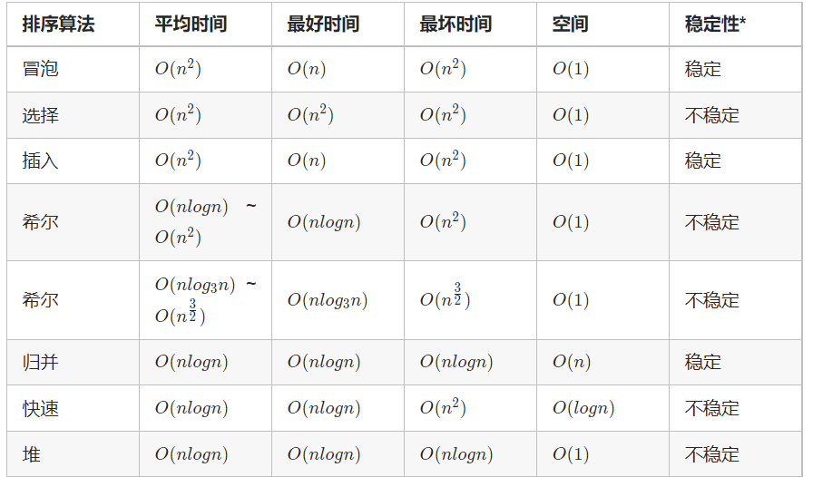
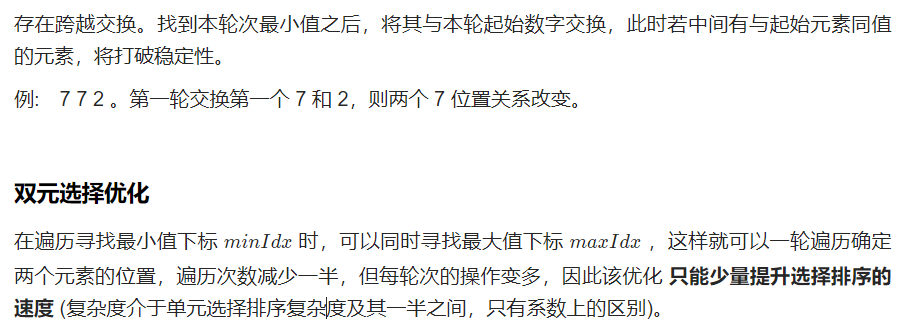
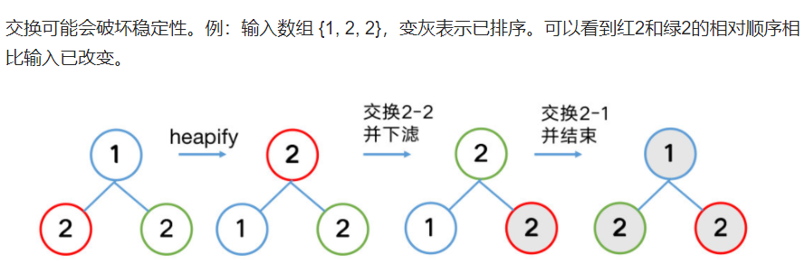
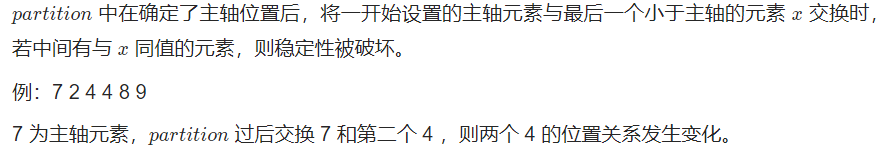
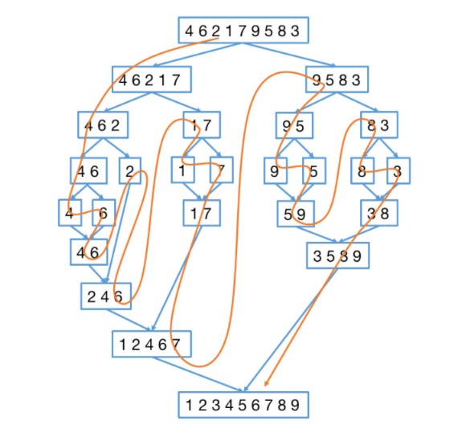
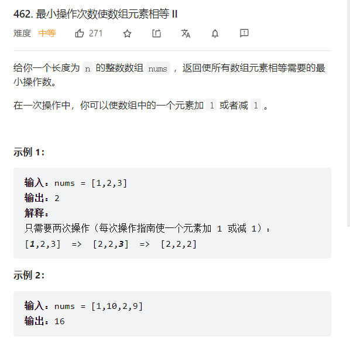

# 排序算法

排序算法主要考虑算法三个点

1. 时间复杂度
2. 空间复杂度
3. 算法稳定性（排序前后相同数值的元素的相对位置不发生）



## 插入排序

### 直接插入排序

1. 算法思想：往前面已经有序的序列中插入一个数字，这个有序的序列再最开始的时候是只有一个数字（一个数字是认为是有序的序列）
2. 时间复杂度O(n^2)
3. 空间复杂度O(1)
4. 稳定性：稳定的算法

```c++
void InsertSort(int arr[],int n){
    for(int i=1;i<n;i++){
        int j;
        if(arr[i]<arr[i-1]){
            for(j=i-1;j>=0;j--){
                 if(arr[j]>arr[i]){
                      arr[j+1]=arr[j];
                 }
                 else{
                    break;
                }
            }
        }
        arr[j]=arr[i];
    }   
}
```

### 希尔排序

```c++
/*
   希尔排序
   n在特殊范围内是O(n^1.3)
   最坏时间复杂度O(n^2)
   O(1)
   不稳定的
*/
void ShellSort(int A[],int n){
    for(int dk=n/2;dk>=1;dk/=2){
        cout<<"Current path length is :"<<dk<<endl;
        for(int i=dk;i<n;i++){
             if(A[i]<A[i-dk]){
                 int j;
                 int temp=A[i];
                 for(j=i-dk;j>=0&&A[j]>temp;j=j-dk){
                       A[j+dk]=A[j];
                 }
                 A[j+dk]=temp;
             }
        }
        display(n);
    }
}
```

## 选择排序

### 简单选择排序

1. 算法思想：对于一个无序序列从第i个位置开始每次都[i+1,n-1]的序列中找出一个最小的值放在第i这个位置

2. 时间复杂度：O(n^2)

3. 空间复杂度：O(1)

4. 稳定性：不稳定的算法

   

```c++
void SimpleSort(int arr[],int n){
    for(int i=0;i<n-1;i++){
        int index=i;
        for(int j=i+1;j<n;j++){
            if(arr[j]<=arr[index]){
                index=j;
            }
        }
        if(i!=index){
            swap(arr[i],arr[index]);
        }
    } 
}
```

### 堆排序

1. 算法思想：建立一个大根堆或者是小根堆（通过上调操作来实现，调整都是从非终端节点开始调整，非终端节点才会有孩子节点），堆建立好之后，每次将根节点的数据和末尾数据进行交换然后再对[0,n-i]范围的数据进行调整为堆结构，一直重复上述操作直到所有数据都有序只止。
2. 时间复杂度：O(nlogn)
3. 空间复杂度：O(1)
4. 算法稳定性：不稳定



```c++
/*
   小根堆(大根堆):从分支节点开始一直往根处走，执行下调操作
   在数组中存储树时，从那个小标为1开始存储，0号空间不使用
   不稳定的排序算法
   O(nlog2n)
*/
#include <bits/stdc++.h>
using namespace std;
#define random(x) (rand()%x)
int data[11];
int length=10;
/*随机生成数据*/
void Initdata(){
    for(int i=1;i<=length;i++){
        data[i]=random(100);
    }
}
/*显示数据*/
void display(int n){
    for(int i=1;i<=n;i++){
        cout<<data[i]<<' ';
    }
    cout<<endl;
}
/*
    下调操作，时间复杂度为O(logn)
*/
void DownAdjust(int low,int high){//对low--high 过程进行调整 
    int i=low,j=2*i;
    while(j<=high){
        if(j+1<=high&&data[j+1]>data[j]){//找到当前根节点的左右孩子中比较的那个
             j=j+1;
        }
        if(data[i]<data[j]){//这里决定建立的时大根堆还是小根堆(data[i]>data[j])
            swap(data[i],data[j]);
            i=j;//沿着调换的节点往下继续调整
            j=2*i;
        }
        else{
            break;
        }
    }
}
/*初始化一个大顶堆*/
void Create(int n){
    for(int i=n/2;i>0;i--){//从分支节点开始处理,n/2
          DownAdjust(i,n);
    }
}
/*堆排序*/
void HeapSort(int n){
    /* 初始化生成一个大顶堆*/
    cout<<"Init a big heap :"<<endl;
    Create(n);
    display(length);
    for(int i=n;i>0;i--){
          swap(data[1],data[i]);
          cout<<"It is a "<<n-i+1<<" order :";
          display(length);
          DownAdjust(1,i-1);//执行下调操作
          cout<<"DownAjust operation:";
          display(length);
          cout<<endl;
    }
}
int main(){
    Initdata();
    display(length);
    Create(length);
    HeapSort(length);
    system("pause");
    return 0;
}

```

### 推排序拓展

- 数组中第K大元素数值

算法思想：堆排序中构建的大根堆中，对于第K次和末尾交换的数据即是我们需要找的数据。

```c++
class Solution {
public:
    void Up(vector<int> &nums,int low,int high){
        int i=low,j=2*i;
        while(j<=high){
             if(j+1<=high&&nums[j+1]>nums[j]){
                  j=j+1;
             }
             if(nums[i]<nums[j]){
                 swap(nums[i],nums[j]);
                 i=j;
                 j=2*i;
             }
             else{
                 break;
             }
        }
    }
    void CreatHeap(vector<int> &nums){
        for(int i=nums.size()/2;i>=0;i--){
             Up(nums,i,nums.size()-1);
        }
    }
    int findKthLargest(vector<int>& nums, int k) {
        CreatHeap(nums);
        for(int i=0;i<k-1;i++){
            swap(nums[0],nums[nums.size()-i-1]);
            Up(nums,0,nums.size()-i-2);
        }
        return nums[0];
    }
};
```


## 交换排序

### 冒泡排序

1. 算法思想：将一个元素和后一个元素进行比较，前者大于后者，二者便进行交换，这样以来每一次都会有一个当前最大元素被放到序列的末尾。一直重复上述操作直到整个序列有序位置
2. 时间复杂度：O(n^2)
3. 空间复杂度：O(1)
4. 算法稳定性：稳定

```c++
void BUbbleSort(int arr[],int n){
    for(int i=0;i<n;i++){
        bool flag=true;
        for(int j=0;j<n-i-1;i++){
            if(arr[j]<arr[j+1]){
                swap(arr[j],arr[j+1);
                flag=false;
            }
        }
        if(flag){
             break;
        }
    }
}
/*双向冒泡*/
void DoubleBubbleSort(int arr[],int n){
    int num=1;
    int low=0,high=n-1;
    int flag=true;
    while(low<high&&flag){
          flag=false;
          /*大的往后走*/
          for(int i=low;i<=high-1;i++){
            if(arr[i]>arr[i+1]){
                 swap(arr[i],arr[i+1]);
                 flag=true;
            }
          }
          high--;
          /*小的往前走*/
          for(int i=high;i>low;i--){
            if(arr[i]<arr[i-1]){
                swap(arr[i],arr[i-1]);
            }
            flag=true;
          }
        low++;
        if(!flag){
            break;
        }
        cout<<"It is "<<num++<<" order:";
        display(length);
    }
}
```

### 快速排序

1. 算法思想：对于一个无序序列，每一次按照左边第一个元素作为基准，将大于他的都放在右边，小于的放在右边，这样这个元素在最终有序序列中的位置就确定了，那边只需要对以这个元素作为一条基线对左右两边的无序序列重复上述操作即可。
2. 时间复杂度：O(nlogn)
3. 空间复杂度：O(1)
4. 算法稳定性：不稳定



```c++
int partition(int arr[],int left,int right){
    int temp=arr[left]
    while(left<right){
          while(left<right&&temp<arr[right]){
                     right--;
          }
          arr[left]=arr[right];
          while(left<right&&temp>=arr[left]){
                     left++;
          }
          arr[right]=arr[left];
    }
    return left;
}
void QuickSort(int arr[],int left,int right){
    if(left<right){
          int index = partition(arr,left,right);
          QuickSort(arr,0,index);
          QuickSort(arr,index+1,right);
    }
}
```

### 快速排序算法拓展

## 归并排序

### 归并排序常规

1. 算法思想：采用分治法的思想，对一个有序的序列先进行分解，一直分解直到成为一个单独的一个元素（认为是有序的序列），在进行合并相邻的两个有序序列
2. 时间复杂度O：(nlogn)
3. 空间复杂度：O(n)
4. 稳定性：稳定



```c++
void Merge(int arr[],int low,int mid,int high){
    int temp[1001];
    int i,j,k;
    for(i=low;i<=high;i++){
        temp[i]=arr[i];//复制一下
    }
    for(k=low,j=low,i=mid+1;j<=mid&&i<=high;){
        if(temp[j]>=temp[i]){
             arr[k++]=temp[i++];
        }
        else{
            arr[k++]=temp[j++];
        }
    }
    while(j<=mid){
        arr[k++]=temp[i++];
    }
    while(i<=high){
        arr[k++]=temp[j++];
    }
}
void MergeSort(int arr[],int low,int high){
    if(low<high){
        int mid=low+(high-low)>>2;
        MergeSort(arr,low,mid);
        MergeSort(arr,mid+1,high);
        Merge(arr,low,mid,high);
    }
    
}
```

### 归并排序算法拓展

- 逆序对问题

```c++
class Solution {
    int res=0;
    void Merge(vector<int> &nums,int low,int mid,int high){
        int temp[50001],i,j,k;
        for(i=low;i<=high;i++){ 
             temp[i]=nums[i];
        }  
        for(i=low,j=mid+1,k=low;i<=mid&&j<=high;){
            if(temp[i]<=temp[j]){
                nums[k++]=temp[j++];
                
            }
            else{
                nums[k++]=temp[i++];
                res+=high-j+1;
            }
        }
        while(i<=mid){
               nums[k++]=temp[i++];
        }
        while(j<=high){
               nums[k++]=temp[j++];
        }
    }
    void MergeSort(vector<int>& nums,int low ,int high){
        if(low<high){
            int mid=low+((high-low)>>1);   
            MergeSort(nums,low,mid);
            MergeSort(nums,mid+1,high);
            Merge(nums,low,mid,high);
        }
    }
public:
    int reversePairs(vector<int>& nums) {
       MergeSort(nums,0,nums.size()-1);
       cout<<res<<endl;
       for(int i=0;i<nums.size();i++){
           cout<<nums[i];
       }
       return res;
    }
};
```


- 小数和问题

```c++
/*
    二路归并排序 扩展
    时间：O(nlog2n)
    空间：O(n)
*/
#include <bits/stdc++.h>
#define random(x) (rand()%x)
using namespace std;
int length=9;
int data[10];
int xiaohe=0;
/*随机生成数据*/
void Initdata(){
    for(int i=1;i<=length;i++){
        data[i]=random(100);
    }
}
/*显示数据*/
void display(int n){
    for(int i=1;i<=n;i++){
        cout<<data[i]<<' ';
    }
    cout<<endl;
}
void Merge(int arr[],int low,int mid,int high){
    int temp[1001],i,j,k;
    for(int i=low;i<=high;i++){//先把数据复制一遍
           temp[i]=arr[i];
    }
    for(i=low,j=mid+1,k=low;i<=mid&&j<=high;k++){
        if(temp[i]<temp[j]){
            xiaohe + =temp[i]*(high-j+1);//在这里统计，小数和或者是逆序对数据
            arr[k]=temp[i++];
            // cout<<xiaohe<<endl;
        }
        else{
            arr[k]=temp[j++];
        }
    }
    while(i<=mid){//这两个只有一个会被执行
         arr[k++]=temp[i++];
    }
    while(j<=high){
         arr[k++]=temp[j++];
    }
}
void MergeSort(int arr[],int low,int high){
    if(low<high){
        int mid=(low+high)/2;
        MergeSort(arr,low,mid);
        MergeSort(arr,mid+1,high);
        Merge(arr,low,mid,high);
        //display(length);
    }
}
int main()
{
    int n;
    Initdata();/*随机数生成初始化数据*/
    cout<<"init data list:";
    display(length);
    MergeSort(data,1,length);
    cout<<"res data list:";
    display(length);
    cout<<endl;
    cout<<xiaohe<<endl;   
    system("pause");
    return 0;
}

```

# 排序相关题目

- 

```c++
class Solution {
public:
    int partition(vector<int> &nums,int left,int right){
         int temp=nums[left];
         while(left<right){
             while(left<right&&nums[right]>temp){
                  right--;
             }
             nums[left]=nums[right];
             while(left<right&&nums[left]<=temp){
                 left++;
             }
             nums[right]=nums[left];
         }
         nums[left]=temp;
         return left;
    }
    void QuickSort(vector<int> &nums,int left,int right){
          if(left<right){
               int index=partition(nums,left,right);
               QuickSort(nums,left,index-1);
               QuickSort(nums,index+1,right);
          }
    }
    int minMoves2(vector<int>& nums) {
        QuickSort(nums,0,nums.size()-1);
        int mid=nums[nums.size()/2];
        int res=0;
        for(int i=0;i<nums.size();i++){
              res+=nums[i]<=mid?mid-nums[i]:nums[i]-mid;
        }
        return res;
    }
};
```

